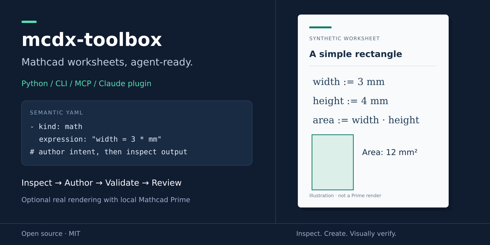

# mcdx-toolbox

[](https://github.com/scodge-24/mcdx-toolbox/actions/workflows/ci.yml)
[](LICENSE)

**Let your AI agent write, edit and check Mathcad Prime calculations for you.**

Ask an agent for a Mathcad calc today and you get a Python script or a wall of
Markdown. It can't produce a real worksheet: `.mcdx` is a zipped XML package
with its own maths markup and absolute page coordinates. Even if the agent
gets that far, it can't see whether the result opens, lays out cleanly or
reads well.

mcdx-toolbox gives the agent that ability. Install it as a Claude Code plugin
(or connect its MCP server to any agent). Your agent can then:

- **write** new Prime worksheets from a plain-English request;
- **transcribe** code clauses, PDFs, scans and hand calcs into live Mathcad
  templates;
- **read** existing worksheets and explain the method inside them;
- **edit** a sheet and check its own work before handing it back.

<!-- TODO: hero image — the request on the left, a real Prime render of the
     resulting worksheet on the right. -->


## What you can ask for

**Write new calcs**

> Write a Mathcad calc checking a 6 m simply supported beam under 12 kN/m for
> bending. Put project "Riverside Warehouse", calc C-014 in the header and a
> utilisation summary at the end.

**Transcribe documents into Mathcad.** The agent reads a PDF, a scanned hand
calc or a photo of a whiteboard and rebuilds it as a live worksheet. It's a
quick way to turn a design guide, a code clause or an old paper calc into a
reusable template.

> Turn clause 6.2.5 of this PDF into a Mathcad template: inputs at the top, the
> formulae as written in the code, and a utilisation check at the end. Crop
> Figure 6.2 in next to the formula that uses it.

> Here's a photo of my hand calc for the pad footing. Transcribe it into
> Mathcad so Prime does the arithmetic, and flag anything you couldn't read.

**Extract workflows from existing sheets.** Years of company knowledge sit in
Mathcad files that only their authors fully understand. The agent can read a
sheet's whole calculation chain and explain it back: inputs, assumptions,
intermediate steps, checks and what feeds what.

> Walk through `connection-design.mcdx` and write up the method as a step-by-step
> procedure: inputs, each step with its reference, and the checks it performs.

> Compare these five old column calcs and tell me whether they follow the same
> method. Where do they differ?

**Edit and review**

> Here's `retaining-wall.mcdx`. Change the retained height to 3.5 m, add a
> sliding check, and tell me what changed.

> Render every page and tell me if anything is clipped, overlapping or
> wrapping badly.

## How the agent does it

1. **Reads what's there.** For an existing worksheet, the agent gets a
   readable outline of every heading, equation and result, plus its
   formatting. It converts the sheet into editable text and is told exactly
   which regions it can't read or safely edit. For a PDF or image source, the
   agent reads it directly and crops any figures it needs to reuse.
2. **Writes intent, not coordinates.** The agent describes the calc as a short
   YAML file: headings, prose with inline maths, definitions, functions,
   figures and utilisation checks. It doesn't hand-place anything; the toolbox
   handles styles, numbering, the page header and layout.

   ```yaml
   - kind: math
     expression: "M_Ed = w_d * L**2 / 8"
   - kind: check
     label: Bending
     utilisation: M_Ed / M_Rd
   ```

3. **Builds a real worksheet.** The equations become live Mathcad maths, so
   Prime does the arithmetic when you open the file, not the agent.
4. **Checks its own work.** The agent validates the package, lints the layout
   for overlaps and overflow, and previews the page geometry. On a Windows
   machine with Mathcad Prime, it renders every page to an image, looks at
   them, and compares them with the previous version. Then it fixes the
   source and goes round again.
5. **Tells you what it proved.** The bundled skill makes the agent say what it
   checked structurally, what it inspected visually, and what it did *not*
   verify numerically.

Built-in rules keep the agent honest. Unsupported blocks and expressions fail
loudly instead of being faked. The agent never invents sign-off names or dates, and
never closes a Prime session you already have open.

## Set it up

You need [uv](https://docs.astral.sh/uv/getting-started/installation/) on the
machine your agent runs on. Put that machine on Windows (or WSL on the same
machine) if you want the agent to render real pages through Prime.

**Claude Code:** inside a session, run

```text
/plugin marketplace add scodge-24/mcdx-toolbox
/plugin install mcdx-toolbox@mcdx-toolbox
```

This installs the Mathcad authoring skill and the worksheet tools. Then just
ask. The first tool call may take a moment while uv fetches dependencies. To
work from a clone instead, use `claude --plugin-dir /absolute/path/to/mcdx-toolbox`.

**Any other MCP-capable agent:** from a cloned checkout, install the CLI with
`uv tool install .` (Python 3.12+), then configure `pymcdx mcp` as a local stdio
server. Installation is currently from source; no PyPI release is available. It
provides `build_worksheet`, `generate_worksheet`, `inspect_worksheet`, `import_worksheet`,
`validate_worksheet`, `layout_check`, `layout_preview`, `render_worksheet` and
`compare_renders`.

The same tools work without an agent from the `pymcdx` command line or Python.
See the [workflow reference](skills/mathcad-authoring/references/workflow.md).

## What it can't do

- **Your engineering judgement still applies.** The toolbox gets the worksheet
  right; Prime does the maths. A clean render is not proof the calc is
  correct, so check it as you would any junior's work.
- **Prime rendering needs Windows.** Without Prime the agent can still build,
  validate and lint worksheets, but it can't show you the final pages. It will
  say that visual review is pending.
- **A4 portrait only**, with one built-in engineering style.
- **Transcription is only as good as the source.** A blurred scan or ambiguous
  handwriting can be misread, so check transcribed values and formulae against
  the original.
- **Only use documents you're allowed to copy.** Cropping figures from a paid
  standard into a calc you share may breach its licence.
- **Editing existing worksheets isn't lossless.** Some Prime content (for
  example certain programs) can't be converted to text. The agent reports it
  instead of guessing.
- **Mathcad Express** may show watermarks or `= ?` for premium features. The
  agent is taught to tell that apart from a broken file.

## Missing something?

If the agent hits something the toolbox can't do, it offers to draft an issue
for you: a bug report or feature request with a small made-up example, never
your own project files. You can also
[open one directly](https://github.com/scodge-24/mcdx-toolbox/issues/new/choose).
Requests from real engineering use decide what gets built next.

## Under the hood

For the curious, or for anyone improving the tool:

- [Mathcad authoring skill](skills/mathcad-authoring/SKILL.md): exactly what
  the agent is told to do.
- [Security and runtime behaviour](SECURITY.md): what the plugin does on your
  machine (no network use at runtime, which processes rendering starts, how
  dependencies are pinned) and how to report a vulnerability.
- [YAML authoring reference](skills/mathcad-authoring/references/authoring.md)
  and [Prime visual review](skills/mathcad-authoring/references/prime-render-visual-check.md).
- Contributing: `uv sync --locked`, then
  `uv run --locked python scripts/verify_release.py` (lint, types, tests,
  packaging).

## Licence

MIT. See [LICENSE](LICENSE), and [NOTICE](NOTICE.md) for font-derived layout
data (SIL OFL 1.1) and dependency notices. Mathcad and Mathcad Prime are PTC
trademarks; this project is not affiliated with or endorsed by PTC or
Anthropic.
